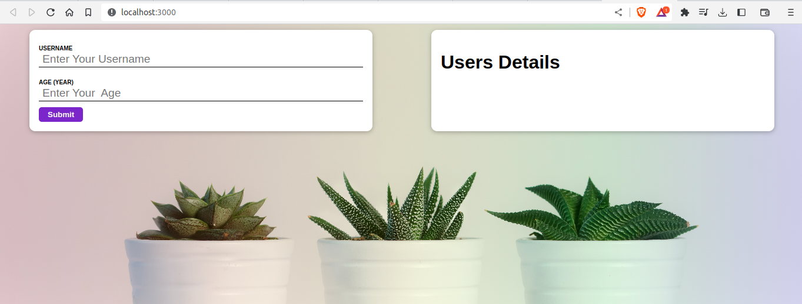
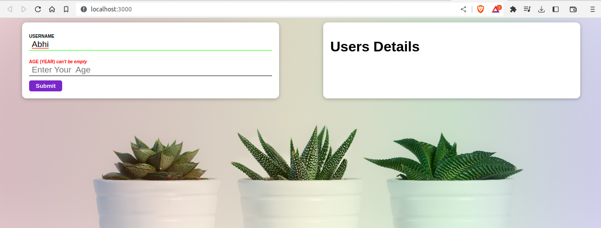
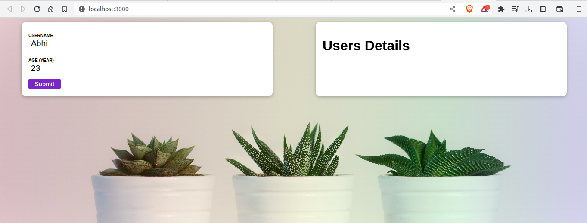
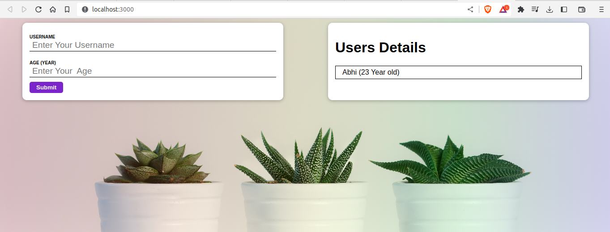

# ReactUser

<h2 style='color:red' >Initial Value</h2>
 

 
<h2 style='color:red' >Submit Error</h2>
 

 
<h2 style='color:red' >User Name Error</h2>
 

 
<h2 style='color:red' >Age Error</h2>
 

 
<h2 style='color:red' >Submit Successfully</h2>
 
